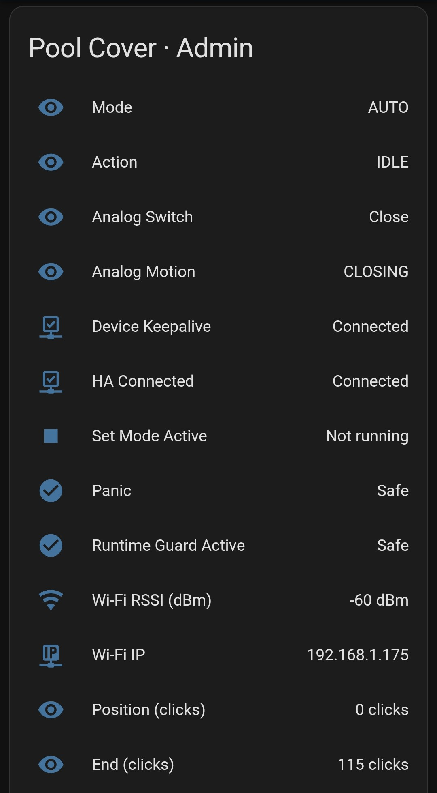
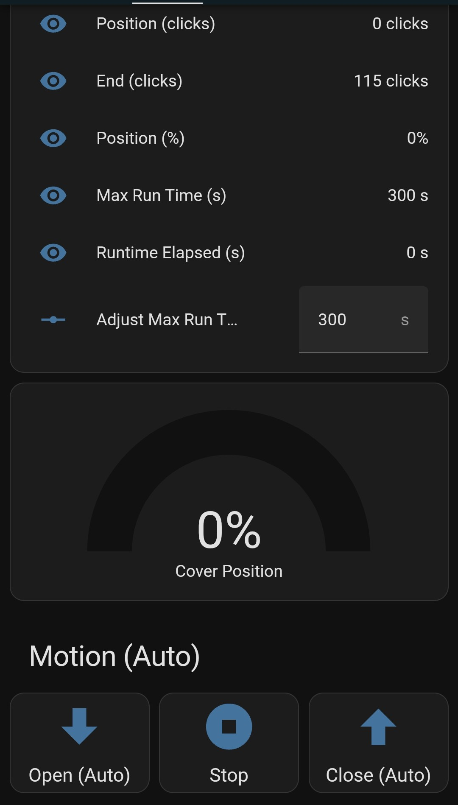
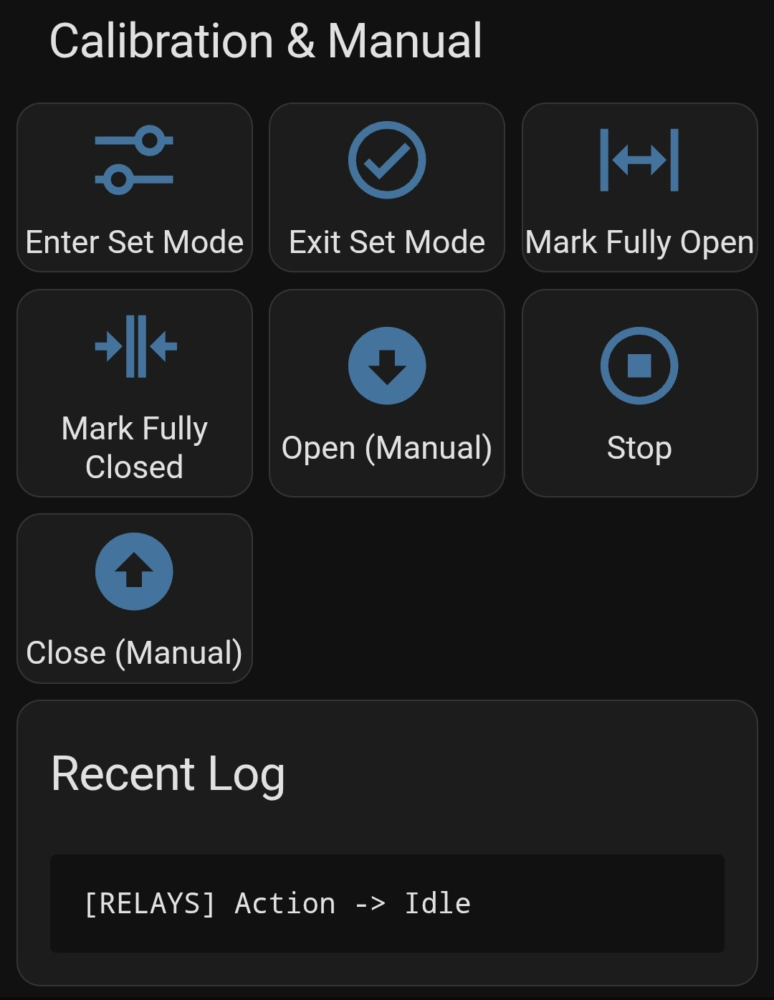
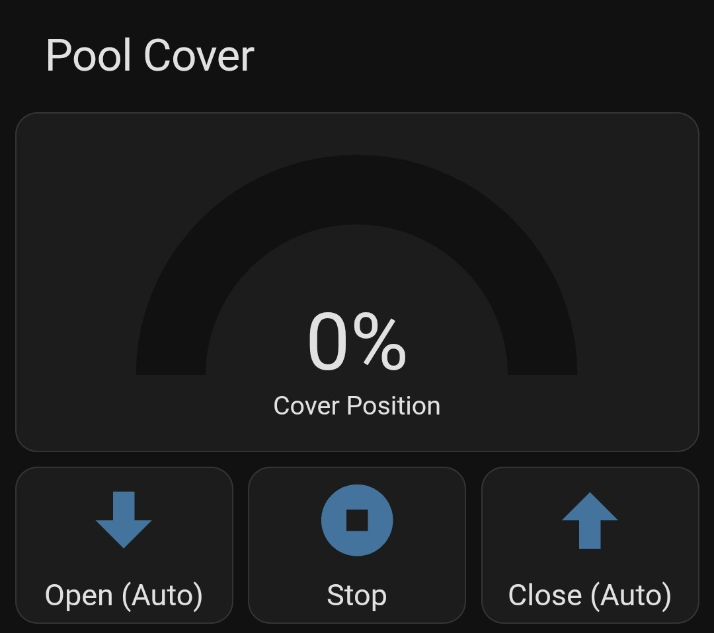

# Pool Cover Controller · ESP32-32U (Headless)

My Unicum Pool (AN1030D) driver died for no reason. I received no service from them (très effronté!), so my inner Terry Davis emerged from annoyance, and I built my own driver. Even if you have to buy everything, this probably costs less than 25€ and has full Home Assistant (MQTT) and Wi-Fi integration.

If you stick to the components listed here, it should be "plug and play" (you still need to connect all the cables, but it's definitely less time than waiting for an answer).

The first version was an ESP32-C6 with a 1.47" touchscreen and a small UI + Home Assistant integration. PM me if you want the UI version (it's not fully tested). I abandoned the UI after some testing; I just wanted to get this mini-project done ASAP, and it was overkill as no one would ever use the UI, and it took 10x the standby power. Now, it's designed for a standard **ESP32-WROOM-32U** (the one with the external antenna connector) and is built to be tough and reliable.

This project was written 99% by Codex (gpt5-codex-high).

Needless to say: I take zero responsibility for the code, the wiring, or anything. Try to contact Unipool if you want a guarantee. This was just fast, cheap, and worked for me, and I hope it helps someone who is also stuck.

---

## Quickstart

This table provides a quick overview of the hardware connections and software configuration.

| Item | Purpose | Configuration |
|:---|:---|:---|
| **Hardware** | | |
| Analog UP input | Control the cover | Connect to GPIO16 |
| Analog DOWN input | Control the cover | Connect to GPIO17 |
| PSU enable relay | Enable the power supply | Connect to GPIO26 |
| Forward relay | Move the cover forward | Connect to GPIO25 |
| Reverse relay | Move the cover backward | Connect to GPIO27 |
| Master / Enable relay | Enable the motor | Connect to GPIO23 |
| PC817 click counter | Measure the cover's position | Connect to GPIO32 |
| Status LED | Show the controller's status | Connect to GPIO19 |
| **Software** | | |
| Wi-Fi SSID | Connect to your Wi-Fi network | Edit `include/wifi_config.h` |
| Wi-Fi Password | Connect to your Wi-Fi network | Edit `include/wifi_config.h` |
| MQTT Broker IP | Connect to your MQTT broker | Edit `src/mqtt_config.h` |
| MQTT Username | Authenticate with your MQTT broker | Edit `src/mqtt_config.h` |
| MQTT Password | Authenticate with your MQTT broker | Edit `src/mqtt_config.h` |

Then get vscode+platformio, download or clone this repo, open the folder, push it to your esp.


## In- and Output
Top-level, these pool drivers are quite simple. I have the Unicum AN1030D (PL3210) with the Motor DL 3010, but I assume that all the drivers from this company are more or less the same from an electronic perspective.

**Input**
*   24V DC high power (>600W) for the DC motor.
*   5V for the logic. Of course, you can buck down from 24V to 5V with an MT3608 or whatever converter you have/buy for the ESP and logic, but in this code, it is separate, and I only turn on the lossy, cheap 24V power supply before the motor is needed.
*   Three cables from the open/neutral/close switch in the living room. One cable is ground; the other two are connected to the ground cable when the open or close switch is pressed. Since the cables are long (in my case, almost 50m), some denoise and protection before the GPIO is highly recommended (though theoretically, it should work without).
*   Three thin cables from the motor to measure the position (clicks). One is ground, one you need to put on 24V, and the third is the measurement, which alternates between 0V and 24V depending on the rotational position of the motor. This needs to be optically isolated using a PC817 or whatever you like to optically isolate and transfer a signal to your ESP.

**Output**
*   Two thick cables from to the motor. The polarity can be switched using the simple relay setup described below. Or use a motor driver if you prefer, the code change is trivial.
*   Wi-Fi -> MQTT -> Home Assistant (Lovelace examples included).
*   Optionally, a status LED.

---

This firmware is "headless," which means there's no screen. You control it with the good old-fashioned **analog wall switch** or through **Home Assistant** via MQTT. We've kept all the important safety features and made them even more robust.

## Key Features (The Good Stuff)

*   **Dual Control:** Use the physical wall switch or your phone via Home Assistant. The wall switch always wins, so no one can mess with the cover while you're standing right there.
*   **Rock-Solid Safety:**
    *   The relays that move the cover are mutually exclusive. It's impossible to turn them both on at the same time.
    *   When changing direction, there's a mandatory 1-second "dead time" to prevent motor strain.
    *   The power supply for the motor is turned on 2 seconds before the motor is asked to move, giving it time to stabilize.
    *   Optional time safety (redundant safety for position counting so that if counting fails, it does not spin indefinitely, potentially damaging the cover).
*   **Knows Where It Is:** A click counter (using a PC817 optical sensor) tracks the cover's position, and it remembers it even if the power goes out.
*   **Tells You Everything:** Extensive logging is sent to both the serial port and MQTT. You can see exactly what it's thinking, in real-time.
*   **Wi-Fi That Works:** The Wi-Fi is set up with a static IP address and will aggressively try to reconnect if it gets disconnected. Because, of course, it will.
*   **Power Outage Proof:** In case the fuse blows or you have a power outage, the position usually gets lost. Not here, as it writes the position to EEPROM in real-time with state-of-the-art balancing to prevent lifetime issues with the flash cells.
*   **Fancy Stuff Optional:** You can easily disable the Wi-Fi and MQTT stuff and just use the hard-wired open/close solution. But in its current state, there is no option to set the open and close position of the cover without Home Assistant. This is very easy to add (just add a button or even just manually grounded GPIO as a reset/set button). Let me know if there is a need for it, but it is probably easier to ask an AI to implement this for you on the fly.

---

## 1. Hardware & Wiring

This is how you wire it up. If you change any of this, you **must** update `include/pins.h` and probably `RelaysModule.h` to make sure the safety rules still work.

| Signal | ESP32 GPIO | Cable Color | Notes |
|:---|:---:|:---|:---|
| Analog UP input | **IO16** | Yellow | Debounced, pulled-up |
| Analog DOWN input | **IO17** | White | Debounced, pulled-up |
| PSU enable relay | **IO26** | Green | Active-low coil |
| Forward relay | **IO25** | Blue | Active-low coil |
| Reverse relay | **IO27** | Brown | Active-low coil |
| Master / Enable relay | **IO23** | Orange | Active-low coil |
| PC817 click counter | **IO32** | Grey | Falling-edge interrupt |
| Status LED | **IO19** | - | Blink codes + click pulses |
| GND | — | Black | Common reference |
| 3V3 | — | Red | Supply for RC / pull-ups |

---

## 2. How It Works (The Brains)

The firmware is made up of several modules that work together:

*   `main.cpp`: The conductor of the orchestra. It initializes everything and runs the main loop.
*   `StatusStore`: A little key/value store that keeps track of the device's status and shows it in Home Assistant.
*   `WifiModule`: Manages the Wi-Fi connection. It's a bit stubborn and won't give up.
*   `AnalogController`: Reads the wall switch and figures out if you want to open, close, or do nothing.
*   `RelaysModule`: The safety enforcer. It controls the relays and makes sure nothing bad happens.
*   `ClickCounter`: Counts the clicks from the motor sensor to know the cover's position. It's backed up to the ESP32's non-volatile storage (NVS).
*   `MqttModule`: Handles all the communication with Home Assistant.
*   `RingLogger`: A rolling 8 KB log of everything that happens.

The main loop prioritizes the analog wall switch. If you use the switch, any command from Home Assistant is ignored. If the click counter gets confused and the position is out of bounds, it triggers a "panic" mode, stops everything, and requires you to enter "set mode" to fix it.

---

## 3. Build & Flash

This project uses PlatformIO.

```bash
# Build the firmware
~/.platformio/penv/bin/pio run

# Flash it to the ESP32
~/.platformio/penv/bin/pio run -t upload

# Watch what it's doing
~/.platformio/penv/bin/pio device monitor --baud 115200
```

If you've updated any packages, it's a good idea to do a clean build:

```bash
~/.platformio/penv/bin/pio run -t clean
```

---

## 4. Configuration

Before you flash the firmware, you need to set a few things up.

1.  **`include/wifi_config.h`**:
    *   Set your `WIFI_SSID` and `WIFI_PASS`.
    *   The static IP is set to `192.168.1.175`. If you need to change it, edit the `WIFI_STATIC_*` macros.

2.  **`src/mqtt_config.h`**:
    *   Update the MQTT broker IP, username, and password.
    *   The `BASE_TOPIC` is `poolcover` by default.

3.  **`include/pins.h`**:
    *   This is the source of truth for all the wiring. Double-check it against your hardware.

---

## 5. Home Assistant Integration






The `configuration_appendix.yaml` and `lovelace_admin.yaml` files in this repository show you how to set up Home Assistant to work with this controller.

*   **`configuration_appendix.yaml`**: Contains the MQTT sensors, binary sensors, and buttons you'll need. Copy the relevant parts into your `configuration.yaml`.
*   **`lovelace_admin.yaml`**: An example of a Lovelace dashboard card that shows the status of the cover, the logs, and gives you control.
*   **`lovelace_native.yaml`**: An example of a Lovelace dashboard card for the normal user (no set function or advanced diagnostics).

**CAVEAT:** The entity names in HASS might change! HASS has some "smart naming" algorithms that are also version-dependent. Just go to MQTT, find the device, output the diagnostics or make a screenshot of the device names, and ask any smart AI tool to rewrite your YAML using exactly your entity names.

---

## 6. Status LED Codes

The GPIO19 LED reports the controller state without blocking the click counter or motion control. When the cover is moving, click edges override every other pattern, so you get immediate feedback that movement is being tracked. Otherwise, the LED cycles through these blink codes:

| Pattern | Meaning |
|:---|:---|
| **Even 0.2 s on / 0.2 s off** | Booting before the first status is known. |
| **Double blink every ~1.8 s** | Wi-Fi or MQTT connection missing; controller keeps retrying. |
| **Short pulse every ~2 s** | Idle with full connectivity. |
| **Triple blink + pause** | Set mode active while you calibrate the limits. |
| **Rapid strobe** | Panic mode or forced reboot after a safety trip. |
| **Click-matched pulses** | Cover drive is energized; LED follows the click sensor edges so you can see motion cadence. |

---

## 7. Circuits (The Sparky Stuff)

This section describes the circuits for the relay wiring and sensor inputs. I can't verify this part, so it's here for your reference.

### Reversing a 24V DC Motor with Two SPDT Relays

This setup lets you reverse the motor using two standard SPDT relays.

*   **Relay A ON, Relay B OFF** → Motor runs one way
*   **Relay A OFF, Relay B ON** → Motor runs the other way
*   **Both OFF or Both ON** → Motor stops (brakes)

**What you need:**

*   Two SPDT relays rated for your motor's voltage and stall current.
*   A bidirectional TVS diode (like `SMBJ36CA`) and/or an RC snubber across the motor terminals to suppress voltage spikes.
*   A bulk decoupling capacitor (470–1000 µF) on the 24V rail.

**Wiring:**

1.  **Motor Commons:**
    *   Relay A COM → Motor Lead 1
    *   Relay B COM → Motor Lead 2
2.  **NC Rails to 0V (GND):**
    *   Relay A NC → 0V
    *   Relay B NC → 0V
3.  **NO Rails to +24V:**
    *   Relay A NO → +24V
    *   Relay B NO → +24V

### PC817 Click Counter

This circuit provides galvanic isolation for the click counter input.

*   **Motor Side:** Motor sensor (+) → ~1.8 kΩ resistor → PC817 Pin 1 (Anode). Motor sensor return (0V) → PC817 Pin 2 (Cathode).
*   **ESP32 Side:** PC817 Pin 4 (Collector) → GPIO32 and a 10 kΩ pull-up to 3.3V. PC817 Pin 3 (Emitter) → ESP32 GND.

### Long Analog Switch Line

To make the long wire run to the wall switch reliable:

*   At the ESP32, for each input:
    *   10 kΩ pull-up resistor to 3.3V.
    *   220–330 Ω series resistor.
    *   100 nF capacitor to GND.
*   Use twisted-pair cable if you can.

---

## 8. Maintenance & Testing

*   **Before you commit any changes,** run `~/.platformio/penv/bin/pio run` to make sure it still builds.
*   **Manual checks are your friend.** Use a multimeter to check your relay wiring before you connect the motor.

---

## Sanitized Files
The following files have been sanitized to remove personal information:

*   `include/wifi_config.h`
*   `src/mqtt_config.h`
*   `init_instuctions.txt`

---

## 9. TODO (maybe someday)

*   Over-the-air (OTA) firmware updates.
*   MQTT auto-presentation so that it gets automatically detected in Home Assistant without the need to add the lines to the `configuration.yaml` manually.

---

*License: MIT. Contributions and safety reviews are very welcome.*