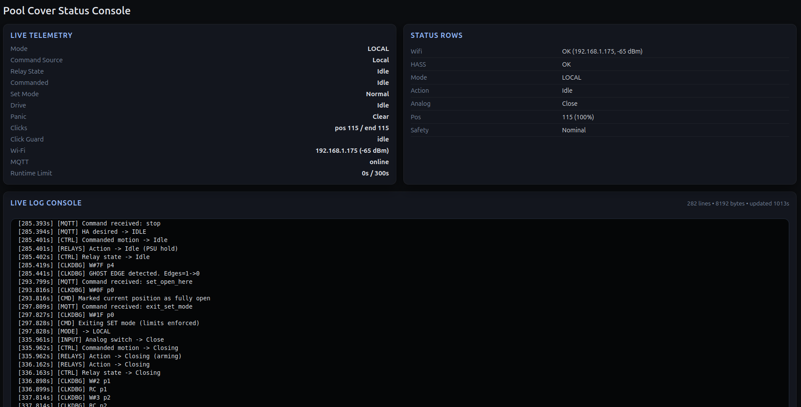

# Pool Cover Controller · ESP32-32U (Headless)

My Unicum Pool (AN1030D) driver died for no reason. I received no service from them (très effronté!), so my inner Terry Davis emerged from annoyance, and I built my own driver. Even if you have to buy everything, this probably costs less than 25€ and has full Home Assistant (MQTT), Wi-Fi integration, OTA updates, and a built-in HTTP console for live diagnostics (and of course supports analog controls).

If you stick to the components listed here, it should be "plug and play" (you still need to connect all the cables, but it's definitely less time than waiting for an answer).

The first version was an ESP32-C6 with a 1.47" touchscreen and a small UI + Home Assistant integration. PM me if you want the UI version (it's not fully tested). I abandoned the UI after some testing; it was overkill and used 10x the standby power. Now it's designed for a standard **ESP32-WROOM-32U** (the one with the external antenna connector) and is built to be tough and reliable.

This project was written 99% by Codex (gpt5-codex-high). Needless to say: I take zero responsibility for the code, the wiring, or anything. Try to contact Unipool if you want a guarantee. This was just fast, cheap, and worked for me, and I hope it helps someone who is also stuck.

---

## Quickstart

This table provides a quick overview of the hardware connections and software configuration.

| Item | Purpose | Configuration |
|:---|:---|:---|
| **Hardware** | | |
| Analog UP input | Control the cover | Connect to GPIO16 |
| Analog DOWN input | Control the cover | Connect to GPIO17 |
| PSU enable relay | Enable the power supply | Connect to GPIO26 |
| Forward relay | Move the cover forward | Connect to GPIO25 |
| Reverse relay | Move the cover backward | Connect to GPIO27 |
| Master / Enable relay | Enable the motor | Connect to GPIO23 |
| PC817 click counter | Measure the cover's position | Connect to GPIO32 |
| Status LED | Show the controller's status | Connect to GPIO19 |
| **Software** | | |
| Wi-Fi SSID / Password | Connect to your Wi-Fi network | Edit `include/wifi_config.h` |
| MQTT Broker, username, password | Connect to your MQTT broker | Edit `src/mqtt_config.h` |
| OTA password/host | Enable OTA uploads | Edit `include/ota_config.h` |

Then get VS Code + PlatformIO, download or clone this repo, open the folder, and flash it to your ESP32.

---

## In- and Output

Top-level, these pool drivers are quite simple. I have the Unicum AN1030D (PL3210) with the Motor DL 3010, but I assume that all the drivers from this company are more or less the same from an electronic perspective.

**Input**
*   24V DC high power (>600W) for the DC motor.
*   5V for the logic (or buck down from 24V to 5V). The firmware keeps the 24V PSU disabled until motion is needed.
*   Three cables from the open/neutral/close switch in the living room. One cable is ground; the other two are connected to that ground when the open or close switch is pressed. Since the cables are long (my run is ~50 m), some denoise/protection before the GPIO is highly recommended.
*   Three thin cables from the motor to measure position (clicks). One is ground, one you bias at 24V, and the third is the measurement, which alternates between 0V and 24V. This needs to be optically isolated using a PC817 (remove the stock LED jumper if your board has one) or any optocoupler you like.

**Output**
*   Two thick cables to the motor. Polarity is switched via relays (or a motor driver if you prefer; code change is trivial).
*   Wi-Fi → MQTT → Home Assistant (Lovelace examples included).
*   Optional status LED.
*   HTTP status console at `http://<device-ip>/` for live telemetry + debug logs.

---

This firmware is "headless," which means there's no screen. You control it with the good old-fashioned **analog wall switch** or through **Home Assistant** via MQTT. We've kept all the important safety features and made them even more robust.

## Key Features (The Good Stuff)

*   **Dual Control:** Physical wall switch and Home Assistant control. The wall switch always wins.
*   **Rock-Solid Safety:**
    *   Direction relays are mutually exclusive.
    *   1 s dead-time before reversing direction.
    *   PSU spins up for 2 s before motion.
    *   Optional runtime safety limit (panic if counting fails and motor runs too long).
*   **Knows Where It Is:** PC817 click counter with optical isolation, 50 ms hardware debounce, a rolling median filter, and persisted EWMA cadence so even cold boots know the motor speed.
*   **Tells You Everything:** Logs go to Serial, MQTT (WARN+), and the HTTP console (full DEBUG). Click events emit compact `[CLKDBG]` codes.
*   **Wi-Fi That Works:** Static IP support, aggressive reconnects, OTA uploads via PlatformIO (`pio run -e esp32_32u_ota -t upload`).
*   **Power Outage Proof:** Positions (and click cadence stats, when enabled) are stored in NVS with wear leveling.
*   **Fancy Stuff Optional:** You can still run it purely from the wall switch if you disable Wi-Fi/MQTT.

---

## 1. Hardware & Wiring

If you change the wiring, update `include/pins.h` (and possibly `RelaysModule.h`).

| Signal | ESP32 GPIO | Cable Color | Notes |
|:---|:---:|:---|:---|
| Analog UP input | **IO16** | Yellow | Debounced, pulled-up |
| Analog DOWN input | **IO17** | White | Debounced, pulled-up |
| PSU enable relay | **IO26** | Green | Active-low coil |
| Forward relay | **IO25** | Blue | Active-low coil |
| Reverse relay | **IO27** | Brown | Active-low coil |
| Master / Enable relay | **IO23** | Orange | Active-low coil |
| PC817 click counter | **IO32** | Grey | Falling-edge interrupt |
| Status LED | **IO19** | — | Blink codes + click pulses |
| GND | — | Black | Common reference |
| 3V3 | — | Red | Supply for RC / pull-ups |

---

## 2. How It Works (The Brains)

*   `main.cpp`: wires everything together.
*   `StatusStore`: keeps rows mirrored to MQTT + HTTP console.
*   `WifiModule`: manages Wi-Fi and status strings.
*   `AnalogController`: debounces the wall switch.
*   `RelaysModule`: enforces dead-time, PSU spin-up, and panic stops.
*   `ClickCounter`: handles ISR click counting, rolling cadence filter, and NVS persistence.
*   `MqttModule`: publishes state, heartbeats, logs, OTA progress, and accepts commands.
*   `RingLogger`: 8 KB buffer backing the MQTT snapshots + HTTP console log stream.
*   HTTP console (`src/HttpConsole.*`): serves telemetry cards, status rows, and the log viewer.

The main loop prioritizes the analog wall switch, then MQTT commands. "Set mode" temporarily relaxes limits for calibration; panic mode latches until reset.

---

## 3. Build & Flash

This project uses PlatformIO.

```bash
# Build the firmware
~/.platformio/penv/bin/pio run

# Flash it to the ESP32
~/.platformio/penv/bin/pio run -t upload

# Watch logs
~/.platformio/penv/bin/pio device monitor --baud 115200
```

If you updated toolchains, clean first:

```bash
~/.platformio/penv/bin/pio run -t clean
```

### OTA Uploads

After the initial USB flash you can push builds over Wi-Fi:

```bash
~/.platformio/penv/bin/pio run -e esp32_32u_ota -t upload
```

The OTA target + password are taken from `include/ota_config.h`. Override with `--upload-port <ip>` if needed.

NOTE: when you use PlatformIO in VSCODE and press the "Upload" button, it will try the USB push first (which is required on the first flash) and then the OTA. Obvisually when you then disconnect USB the USB push will fail but the OTA push will work (as long as you set all the wifi settings correctly). If both are connected, it will be written twice. You can remove either build from the platformio.ini if you only need one or the other. 

---

## 4. Configuration

**IMPORTANT:** Before building, you **must** update the following files with your credentials (they contain placeholders like `YOUR_SSID`).

1.  **`include/wifi_config.h`**
    *   Set `WIFI_SSID`, `WIFI_PASS`, and (optionally) `WIFI_STATIC_IP` (comment out if using DHCP).
2.  **`src/mqtt_config.h`**
    *   Set `MQTT_BROKER_HOST` (IP address), `MQTT_USERNAME`, and `MQTT_PASSWORD`.
    *   Adjust topic names if desired.
3.  **`include/ota_config.h`**
    *   Set `OTA_PASSWORD` (used for OTA uploads) and `OTA_HOSTNAME`.
4.  **`platformio.ini`**
    *   Update `upload_port` to your device's IP address for OTA uploads (e.g., `192.168.1.175`).
5.  **`include/pins.h`**
    *   Verify the pin map matches your hardware wiring.
6.  **`src/ClickCounter.h`**
    *   `CLICK_COUNTER_INTERVAL_FILTER_ENABLED`: Enable for rolling median + EWMA cadence guard.
    *   `CLICK_COUNTER_INTERVAL_PERSIST_ENABLED`: Checkpoint cadence to NVS (helps cold boots).
    *   `CLICK_COUNTER_USE_SIMULATION`: Set to `true` if testing without hardware.
7.  **HTTP Console**
    *   Visit `http://<device-ip>/` after flashing to view telemetry and logs.

---

## 5. Home Assistant Integration

<table>
  <tr>
    <td></td>
    <td></td>
  </tr>
  <tr>
    <td></td>
    <td></td>
  </tr>
</table>

*   `configuration_appendix.yaml`: MQTT sensors, binaries, buttons—copy what you need.
*   `lovelace_admin.yaml`: advanced dashboard (includes log + calibration actions).
*   `lovelace_native.yaml`: user-friendly cover card.

**CAVEAT:** Entity names vary with HASS versions. Inspect MQTT auto-discOVERY output and adjust the YAML (or ask an AI to rewrite using your names).

---

## 6. Status LED Codes

| Pattern | Meaning |
|:---|:---|
| Even 0.2 s on / 0.2 s off | Booting |
| Double blink every ~1.8 s | Wi-Fi or MQTT missing |
| Short pulse every ~2 s | Idle, fully connected |
| Triple blink + pause | Set mode active |
| Rapid strobe | Panic / forced reboot |
| Click-matched pulses | Motor energized (click edges mirrored) |

---

## 7. Circuits (The Sparky Stuff)

### Reversing a 24V DC Motor with Two SPDT Relays

*   Relay A ON / Relay B OFF → Open
*   Relay A OFF / Relay B ON → Close
*   Both OFF (or both ON) → brake/stop

Parts: two SPDT relays sized for stall current, TVS or RC snubber across the motor, 470–1000 µF bulk cap on 24V.

### PC817 Click Counter

*   Motor side: sensor (+) → ~1.8 kΩ → PC817 anode; sensor return → PC817 cathode. Remove the built-in LED jumper if your breakout has one so the motor sensor isn’t backfed.
*   ESP32 side: PC817 collector → GPIO32 with 10 kΩ pull-up to 3.3V **and** a 470 nF ceramic to GND (mount it near the optocoupler to kill fEMI spikes). PC817 emitter → ESP32 GND.
*   Firmware adds a 50 ms debounce (ISR gate) and the optional rolling interval filter; cadence stats are written to NVS at every stop when enabled.

### Long Analog Switch Line

Each input gets: 10 kΩ pull-up to 3.3V, 220–330 Ω series resistor, 100 nF to GND. Use twisted pair wiring where possible.

---

## 8. HTTP Status Console

The on-device console at `http://<device-ip>/` shows:

*   Telemetry card (mode, command source, relay state, runtime guard, Wi-Fi/MQTT link, click guard state).
*   Table of `StatusStore` rows (same text seen via MQTT).
*   Log viewer streaming the full ring buffer regardless of MQTT log level.



### `[CLKDBG]` Log Legend

| Pattern | Meaning |
|:---|:---|
| `[CLKDBG] R{C/O/I}{t?} p<pos>` | Accepted click: direction `C`/`O`/`I`, `t` marks tail-hold usage, position number at the end. |
| `[CLKDBG] W#<slot>[F] p<pos>` | Position persisted to NVS slot `0–7`; `F` indicates a forced persist (e.g., stop event). |
| `[CLKDBG] XF d<ms> m<ms>` | Interval filter rejected a click because the delta `d` ms was below ~60% of the rolling median `m` ms (typical EMI spike). |

---

## 9. Maintenance & Testing

*   Run `~/.platformio/penv/bin/pio run` before committing changes.
*   Use a multimeter to verify relay wiring and motor polarity.
*   Check the HTTP console log for `[CLKDBG] XF …` lines if you suspect noise.

---

## Sanitized Files

The following files contain sensitive placeholders and **must be updated** before use:

*   `include/wifi_config.h` (SSID, Password, Static IP)
*   `include/ota_config.h` (OTA Password)
*   `src/mqtt_config.h` (MQTT Broker IP, User, Password)
*   `platformio.ini` (OTA Upload Port IP)
*   `init_instuctions.txt` (Example configuration)

---

## 10. TODO (maybe someday)

*   MQTT auto-discovery to avoid hand-editing `configuration.yaml`.
*   More automated tests around persistence and panic paths.
*   Hardware notes for different relay boards / motor drivers.

---

## 11. Signal Integrity & Troubleshooting
 
If you experience "drift" or "overcounting" (cover stops too early), it is likely due to electrical noise or mechanical rebound triggering false clicks. This firmware includes advanced signal processing to mitigate this:
 
1.  **Settled State Verification**: The ISR waits for 30ms of stability and then verifies that the physical pin state matches the edge count. This eliminates "ghost edges" caused by short noise spikes that return to the original state.
2.  **Cumulative Time Error Heuristic**: The system tracks the total time vs. total clicks. If the motor appears to run "too fast" (negative time error), it implies ghost clicks are being counted. The system will reject these extra clicks until the time budget balances out.
3.  **Median Filter**: A 15-sample rolling median filter establishes a robust "expected speed" baseline to detect anomalies.
 
### Debug Logs
Check the HTTP console for these indicators:
*   `[CLKDBG] GHOST EDGE detected`: A noise spike was successfully filtered by state verification.
*   `[CLKDBG] MISSED EDGE detected`: The system corrected a missed transition.
*   `[CLKDBG] ERR t<err> ...`: The cumulative time heuristic rejected a click to correct the speed.
 
---
 
*License: MIT. Contributions and safety reviews are very welcome.*
